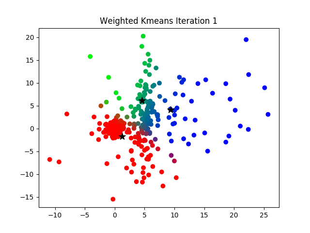
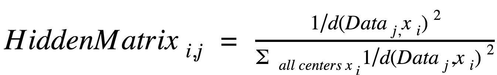
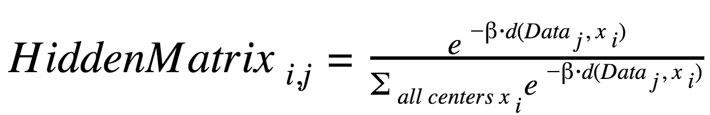

# *k*-Means Clustering
### An Overview of Two Different Approaches to the Clustering Problem

1. [Introduction](#1)
2. [Filtering Algorithm](#2) 
    2.1. [Elements](#21) 
    2.2. [Procedure](#22)
3. [Fuzzy *c*-Means](#3) 
    3.1. [Elements](#31) 
    3.2. [Procedure](#32)
4. [Comparison](#4)
5. [Selected methods comparison](#235)

---

## 1 Introduction<a name="1">

The essential goal of  *k*-means clustering is as follows:

>Given any number of data points (*n*) in *d*-dimensional space and an integer *k*, determine a set of of *k* clusters to minimize the mean squared distance(often *squared-error distortion*) from each data point to its nearest cluster center.

Clustering, as a category of classification algorithms, is considered an NP-hard optimization problem (Vattani). As such, there are a variety of approaches and heuristic algorithms that allow for the clustering problem to be solved efficiently for many different types of data. Two major approaches to clustering are *k*-means clustering and fuzzy *c*-means clustering. Each performs a clustering on the given data, though the outcome of each approach is slightly different.
</a>

## 2 Filtering Algorithm<a name="2">

The filtering algorithm is a simplified version of Lloyd's algorithm, an iterative two-step procedure that converges to a local minimum when performing clustering. Lloyd's algorithm is one of many *k*-means clustering algorithms. As with many approaches to clustering, the algorithm is often run many times to ensure that the best possible clustering of points is achieved.

</a>

  
The first iteration using Lloyd's Algorithm(<a href="https://upload.wikimedia.org/wikipedia/commons/5/5a/LloydsMethod1.svg">source</a>). 

  
The second iteration using Lloyd's Algorithm(<a href="https://upload.wikimedia.org/wikipedia/commons/7/77/LloydsMethod2.svg">source</a>). 

  
The third iteration using Lloyd's Algorithm(<a href="https://upload.wikimedia.org/wikipedia/commons/f/fb/LloydsMethod3.svg">source</a>). 

### 2.1 Elements<a name="21">
 The filtering algorithm requires several elements to function as required (Kanungo et al.). These elements include:

1. **kd-tree**: A binary tree which represents the hierarchical subdivision of the points.
2. **Box**: An axis-aligned hyper-rectangle.
3. **Bounding Box**: The smallest box containing all the points.
4. **Cell**: A closed box. In the kd-tree, each node is associated with a cell
5. **Leaf**: A cell containing at most one point.
</a>

### 2.2 Procedure<a name="22">
Once the basic framework for performing the clustering has been laid down, the algorithm is performed as follows.

1. The kd-tree is constructed from all the points.
    * Each node of the the kd-tree maintains a list of *candidate centers*. These are a "a subset of center points that might serve as the nearest neighbor for some point lying within the associated cell" (Kanungo et al.).
    * As the algorithm progresses, the candidate centers are "filtered" as the tree is traversed.  
2. Propogate through the tree, visiting every node in the process.
    1. Each node *u* is associated with a Cell *C* and a Candidate Set *Z*.
        1. The goal is to find the candidate closest to the midpoint of *C*, *z**, which belongs to the Candidate Set *Z*.
        2. The Cell *C* is compared to every element of *Z*. If no element of *C* is closer to an element of *Z*, *z*, than it is to *z**, the current *z* is not the center to any of the points in node *u*. Then, *z* is removed as a potential candidate center.
        3. If the node *u* has only one candidate center *z**, then *z** is the nearest center of all the points in node *u*. Each point in *u* is assigned *z** as a center (if the node is not an internal node).
        4. If a node is an internal node, then the routine is preformed on all of its child nodes.
        5. If the current node *u* is a leaf node (meaning it has no children), the distance is computed from each of the data points in node *u* to the candidate centers in *Z*, assigning the closest center to each point.
</a>

## 3 Fuzzy *c*-Means<a name="3">

Another algorithm that is used for clustering is the fuzzy *c*-means algorithm(also referred to as soft *k*-means). Unlike in the filtering algorithm, where each data point is associated with a single center, fuzzy *c*-means allows for each data point to be associated with multiple centers. Each point is represented by a collection of weights which quantify how close a point is to the various different centers.
</a>

 
An example of a clustering using fuzzy *c*-means(<a href="https://sandipanweb.wordpress.com/2017/03/19/hard-soft-clustering-with-k-means-weighted-k-means-and-gmm-em/">source</a>).

### 3.1 Elements<a name="31">

There are several major elements that are crucial to performing the computations for the fuzzy *c*-means algorithm. 

1. : The Stiffness Parameter. It specifies at which point the clustering has convereged.
2. ***K***: The number of clusters to be found.
3. ***Hidden Matrix***: A *k*x*n* matrix (*k* is the number of clusters and *n* is the number of data points) that contains the relative weights of each point to each center.
</a>

### 3.2 Procedure<a name="32">

When performing fuzzy *c*-means clustering on a given data set, there are two major steps that are performed. First, *k* centers are selected. The method of selection is unimportant, as the purpose of the algorithm is to adjust the centers to best fit the given data. Due to this, the centers are often selected randomnly. As with the filtering algorithm, fuzzy *c*-means is also performed many times to 

**E-step**: Once the centers have been selected, weights are assigned to each point from each of the cluster centers. A higher weight between a point and a center indicates that the center bears a higher responsibility in classifying the point.

**M-step**: Once all the points have been assigned relative weights, the centers are recomputed, assigning new "soft" centers to each point. 

When performing the computations to identify the new center, any function can be used. One particular function is the following distance function (Pevzner):

Another potential function that can be used, which often come up with better results is as follows (Pevzner):

The E- and M-steps are repeated, starting with the M-step, until the algorithm reaches the point of converegence, which is specified by the parameter, . If the algorithm converges between two M-steps, then the centers remain stationary, and the algorithm ends.  
</a>

## Comparison<a name="4">

Many aspects of the algorithms can be considered when comparing the filtering algorithm and the fuzzy *c*-means algorithms. Both arrive at clustering that would be considered good in most cases, although the two algorithms would be used in different senarios. Examining the time complexities of the two algorithms, we see that there is a significant difference in the speed of calculations between the two algorithms. Given *n* data points, *c* clusters, *d* dimensions, and *i* iterations, the complexity of *k*-means is *O(ncdi)* and the complexity of fuzzy *c*-means is *O(ndc*2*i)* (Ghosh). Fuzzy *c*-means has a greater time complexity due to the additional calculations required to compute the distances between every point and every center.

Both approaches to clustering are valid when considering the task of classification. Fuzzy *c*-means 

## Works Cited

Jain, Anil K. “Data Clustering: 50 Years beyond K-Means.” *Pattern Recognition Letters*, vol. 31, no. 8, 2010, pp. 651–666., doi:10.1016/j.patrec.2009.09.011.

Kanungo, T., et al. “An Efficient k-Means Clustering Algorithm: Analysis and Implementation.” *IEEE Transactions on Pattern Analysis and Machine Intelligence*, vol. 24, no. 7, 7 Aug. 2002.

“Bioinformatics Algorithms: an Active Learning Approach.” *Bioinformatics Algorithms: an Active Learning Approach*, by Phillip Compeau and Pavel Pevzner, Active Learning Publishers, 2015, pp. 100–103.

Ghosh, Soumi, and Sanjay Kumar. “Comparative Analysis of K-Means and Fuzzy C-Means Algorithms.” International Journal of Advanced Computer Science and Applications, vol. 4, no. 4, 2013, doi:10.14569/ijacsa.2013.040406.
